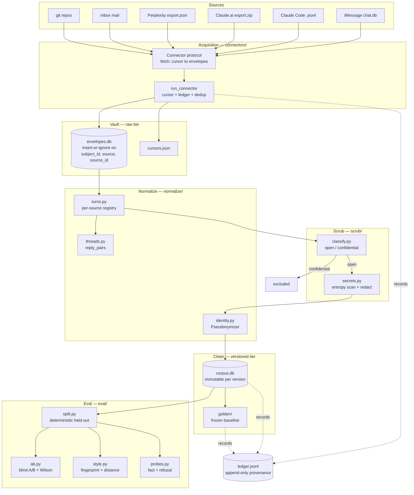

# Architecture

How data moves from a raw export to a scored evaluation, and the constraints that
shape every stage. Companion to the design spec in `superpowers/specs/`; this
document describes what is **built**, the spec describes what is intended.

## Data flow

## Layers

### Acquisition — `connectors/`

One `Connector` protocol, six implementations. Each yields `(RawEnvelope, cursor)`
pairs; `run_connector` handles cursor persistence, vault writes, de-duplication, and
the ledger entry.

Backfill and incremental ingest share one code path — only the cursor value differs.
Two paths would drift and silently produce two differently-shaped corpora that
nothing would flag.

| Connector     | Source                         | `source_id`                    | Cursor               |
| ------------- | ------------------------------ | ------------------------------ | -------------------- |
| `imessage`    | chat.db (+ typedstream decode) | message rowid                  | rowid high-water     |
| `claude_code` | session `.jsonl` transcripts   | hash(file, offset, text)       | per-file byte offset |
| `claude_ai`   | export zip                     | server message uuid            | whole-file size      |
| `perplexity`  | export json                    | server entry uuid              | whole-file size      |
| `mail`        | mbox                           | Message-ID (path:idx fallback) | per-file index       |
| `git_repos`   | commit messages                | commit sha                     | last sha             |

Two cursor models, chosen by what the source guarantees:

- **Append-only logs** (`claude_code`, `mail`) resume mid-file by byte offset or
  index. `claude_code` deliberately leaves its cursor at the _start_ of an incomplete
  final line — advancing past unparseable bytes permanently loses that message.
- **Static snapshots** (`claude_ai`, `perplexity`) use `scan_snapshot_exports`: a
  whole-file marker emitted only with a file's last envelope, so a crash midway
  leaves the export re-scannable. Safe **only** because those sources carry stable
  server ids, making a re-scan a no-op.

### Storage tiers — `paths.py`

Four directories per subject, all under the git-ignored `data/`:

- **`vault/`** — raw envelopes exactly as ingested, never edited. The audit trail.
- **`clean/`** — versioned scrubbed corpus. `CorpusStore.write` refuses to overwrite
  an existing version, so a bad build is superseded rather than repaired.
- **`exportable/`** — the only tier permitted to leave the machine.
- **`golden/`** — the frozen pre-deployment baseline, plus superseded ones.

### Normalize — `normalize/`

`turns.py` holds a per-source registry mapping `RawEnvelope` to the unified `Turn`.
An unregistered source raises rather than silently passing through.

Unknown grouping keys never share a sentinel. A missing, empty, or literal
`"unknown"` thread key becomes a per-record orphan id — a shared placeholder would
merge unrelated turns into one fabricated conversation, which then feeds fake reply
pairs into eval and training. This was not hypothetical: 568 real iMessage turns hit
it, via a SQL `COALESCE(chat_guid,'unknown')`.

### Scrub — `scrub/`

**Classification runs before redaction.** A confidential turn is excluded entirely
rather than scrubbed; redacting first would waste work and risk making a client
record look retainable once its markers were replaced.

`classify` errs toward `confidential` wherever a pattern's breadth is a judgement
call — a false positive costs a little corpus fidelity, a false negative leaks a
third party's regulated data into a corpus that may reach a hosted model. The costs
are not symmetric.

`redact` raises `ScrubError` rather than half-scrubbing, so the build fails closed.

> **Scope limit.** `classify` measures confidentiality _to third parties_ — it
> deliberately returns `open` for the subject's own sensitive writing (health, legal,
> financial). A clean `corpus_audit` is therefore **not** evidence that nothing
> sensitive is present. Sensitivity-to-the-subject is an unhandled axis and a policy
> decision, not a defect to patch silently.

### Eval — `eval/`

- `split.py` — deterministic held-out split, bucketed **by thread**, not by turn.
- `style.py` — style fingerprint, pairwise distance, and a self-distance band.
- `ab.py` — blind A/B trial construction and Wilson-interval scoring.
- `probes.py` — fact and refusal probe sets.
- `baseline.py` — pinned baseline configs with a content fingerprint.

Thread-level bucketing is load-bearing. Turn-level shuffling puts both halves of a
conversation in the same split and measures sampling noise instead of style
distance — it produced a band the subject's own writing failed.

## Correctness constraints

Four constraints from spec §9.3, all unrecoverable if deferred, which is why they
land in stages 0–2 rather than at training time.

| ID      | Constraint                  | Enforcement                                                                                                                                                |
| ------- | --------------------------- | ---------------------------------------------------------------------------------------------------------------------------------------------------------- |
| **CC1** | Assisted/unassisted tagging | `Turn.assisted` is a required bool with **no default** — a normalizer that forgets it fails loudly instead of recording AI-assisted text as human-authored |
| **CC2** | Golden corpus freeze        | `freeze_golden` + checksum verified on every `load_golden`                                                                                                 |
| **CC3** | Rolling held-out quarantine | `quarantine.split` — newest N weeks never trained on or indexed                                                                                            |
| **CC4** | Model-collapse guard        | Specified; no sampler exists yet                                                                                                                           |

### CC2 in practice

The golden corpus is the reference for the subject's voice _before the system
existed_. `freeze_golden` refuses to overwrite an existing freeze.

That is a purpose test, not a file-immutability test, so `supersede_golden` allows
re-pointing the baseline at a newer **pre-deployment** build — otherwise the baseline
is frozen at an accident of which connectors existed on the day of the first cut.
Two hard refusals preserve what CC2 actually protects:

- `GoldenNotASuperset` — no baseline turn dropped, no text rewritten. Otherwise
  measured drift reflects the baseline moving rather than the subject changing,
  silently invalidating every prior comparison.
- `GoldenPostDeployment` — no `assisted=True` turn. Once the system's own output
  enters the reference for the subject's unassisted voice, no later build undoes it.

Superseded snapshots are archived, never deleted, and the re-cut is recorded in the
ledger. **This stops being safe once draft-as-me deploys**: from then on new turns
can be assisted, and "strict superset" no longer implies "pre-deployment".

## Provenance — `ledger.py`

An append-only `ledger.jsonl` records every ingest, corpus build, and golden
supersede, with parent links forming a source → corpus → persona chain.

This is not a logging convenience. It is the mechanism that makes consent revocation
executable: without an unbroken chain, "you may withdraw your data" cannot be
honored. Any change making entries mutable breaks a stated commitment to data
subjects.

`run_connector` writes its ledger entry **even when a connector raises mid-stream**,
marking the ingest partial — rows written before a failure must not be left with no
provenance. The cursor is deliberately not advanced on failure; resuming is safe
because vault writes are idempotent.

## Testing conventions

341 tests. Two conventions worth knowing:

- **Guards are mutation-tested.** Breaking the specific behavior a test claims to
  cover must turn that test red. A guard whose removal fails nothing has no coverage,
  whatever the test is named.
- **Fixtures must actually create the condition under test.** Eleven tests in this
  project have named a condition their fixture never created. The recurring tell is a
  fixture value whose property is computable but unchecked.
